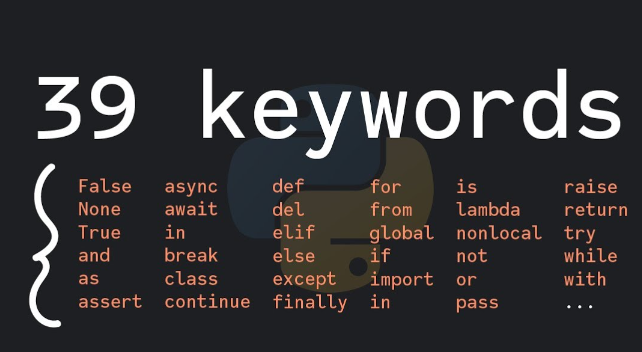

## Python Character Set

        1. Letters - A to Z, a to z
        2. Digits - 0 to 9
        3. Special Symbols - +-*/
        4. Whitespaces - Blank Space, tab, carriage return, newline, formfeed
        5.Other characters

## VARIABLES

        Variables are the names of memory locations
        1) Identifiers can be a combination of upperCase and lowerCase letters, digits and underscore.
        2) Can't start with a digit.
        3) Can't use special symbols like !,#,@,%,$.
        4) Can be of any length.

## DATA TYPES

        Integers
        String
        Float
        Boolean
        None

## Keywords

        Keywords are reserved words in python.

## COMMENTS

        # Single Line Comment
        '''
        Multi Line
        Comment
        '''
